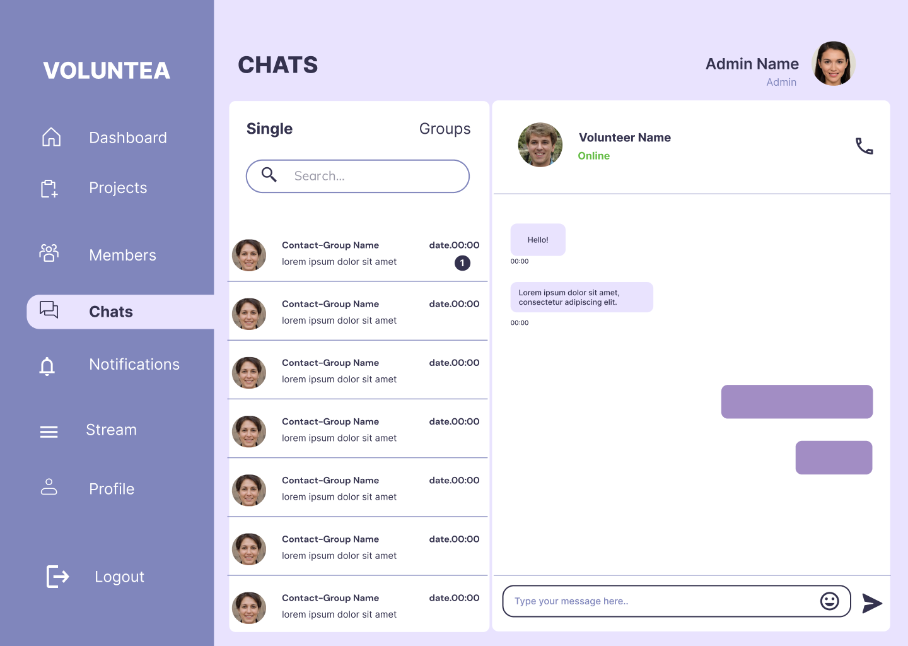
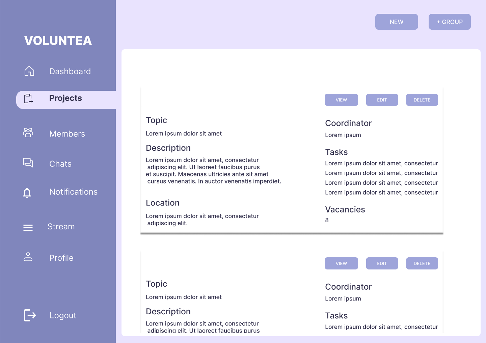
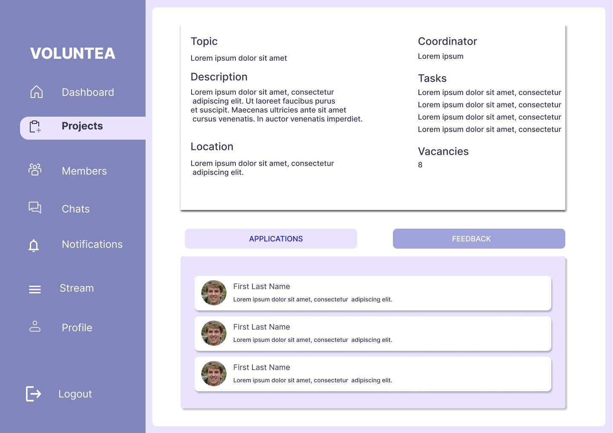

<br><br>

<!-- project philosophy -->


> A web app that fosters collaboration between non-profits and volunteers, simplifying communication, scheduling, and appreciation.
>
> VolunTea harmonizes non-profits with their volunteers, streamlining communication, scheduling and recognition. Administrators manage opportunities and nurture a community. Volunteers find purpose through this hub, where they can showcase skills, connect and create a fulfilling volunteer experience.

### Admin Stories

- As an administrator, I want to be able to create a profile about our organization to showcase our mission, impact, and projects.
- As an administrator, I want to be able to create opportunities, so that volunteers can sign up for.
- As an administrator, I want to be able to accept or reject a volunteer’s application for a particular opportunity.
- As an administrator, I want to be able to communicate with volunteers through messages, so I can send and receive notifications.
- As an administrator, I want to be able to recognize our volunteers and certify them for their engagements and contributions.

### Volunteer Stories

- As a volunteer, I want to be able to sign up using an organization’s code, so I can be a member of its community.
- As a volunteer, I want to be able to edit my profile, so that my information and new skills are up-to-date.
- As a volunteer, I want to be able to browse through volunteering opportunities, so I can sign up in case I’m interested.
- As a volunteer, I want to be able to receive notifications and reminders about upcoming shifts and events. 
- As a volunteer, I want to be able to receive a certificate that shows my contribution as proof of my volunteer work


<br><br>

<!-- Prototyping -->


> VolunTea is designed using wireframes and mockups, iterating on the design until reaching the ideal layout for easy navigation and a seamless user experience.

### Mockups
| Chats Screen  | Projects screen |  Project Details screen |
| ---| ---| ---|
|  |  |  |

<br><br>

<!-- Implementation -->


> Using the mockups as a guide, VolunTea app was implemented with the following features:

### User Screens
| Login screen  | Register screen | Landing screen | Loading screen |
| ---| ---| ---| ---|
|  |  |  |  |


### Admin Screens (Web)
| Login screen  | Register screen |  Landing screen |
| ---| ---| ---|
|  |  |  |
| Login screen  | Register screen |  Landing screen |
|  |  |  |

<br><br>

<!-- Tech stack -->


###  VolunTea is built using the following technologies:

- This project uses the [Laravel app development framework](https://laravel.com/)). 

<br><br>

<!-- How to run -->


> To set up Coffee Express locally, follow these steps:

### Prerequisites

This is an example of how to list things you need to use the software and how to install them.
* npm
  ```sh
  npm install npm@latest -g
  ```

### Installation

_Below is an example of how you can instruct your audience on installing and setting up your app. This template doesn't rely on any external dependencies or services._

1. Get a free API Key at [https://example.com](https://example.com)
1. Clone the repo
   ```sh
   git clone https://github.com/zaynabnour-alghosh/VOLUNTEA.git
   ```
2. Install NPM packages
   ```sh
   npm install
   ```
2. Install Composer packages
   ```sh
   composer install
   ```

Now, you should be able to run VolunTea and explore its features.
